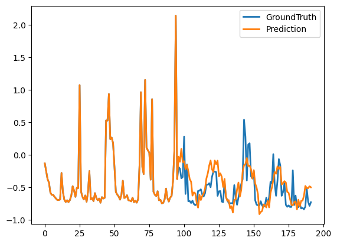
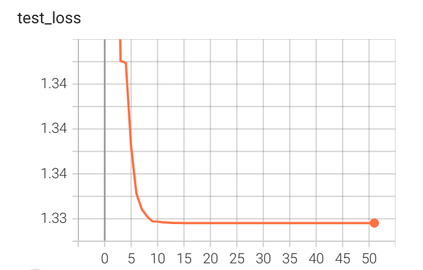
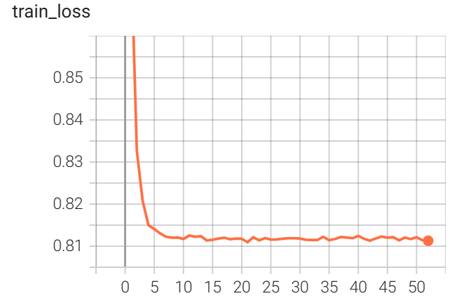

# TimesNet: Temporal 2D-Variation Modeling for General Time Series Analysis
paper: https://arxiv.org/abs/2210.02186

source code: https://github.com/thuml/TimesNet

[ICLR2023 | TimesNet: 时序基础模型，预测、填补、分类等五大任务领先 - 知乎 (zhihu.com)](https://zhuanlan.zhihu.com/p/606575441)

## Refactor Existing Code Structure

We have made a series of modifications and optimizations to the engineering open source code to improve its quality and maintainability. Among them, we have refactored the code architecture to improve code decoupling and cross-platform compatibility, making it easier to expand and maintain. In addition, we have introduced tensorboard to achieve real-time visualization, visualizing the changes of prediction results and loss functions, making it easier for users to understand the code running status more intuitively. These modifications and optimizations will make our code more in line with industrial code standards, better able to meet user needs, and bring higher efficiency and quality assurance to our team in the future.

1) We have made significant enhancements to the  `ren.py ` file to support parameter tuning via both reading yaml files and providing command-line parameters. It is essential to note that the parameters passed through command-line arguments take precedence and can be used to modify the path to the yaml file. This can be achieved by modifying the  `cfg_path ` variable in the  `ren.py `file.
2) We have added tensorboard to `./exp/exp_long_term_forecasting.py` to record changes in the loss function during training. The logs are saved in `./logs/train/` and can be viewed using tensorboard by running the command tensorboard `$--logdir="./logs/train"`.

3) We have made modifications to the code in `./utils/tools.py `to save test results in png format instead of pdf format, making it easier and more convenitent for you to see the results.

4) If you want to run the code, all you need simply run `run.py` after preparing your own yaml file. 

## Result

